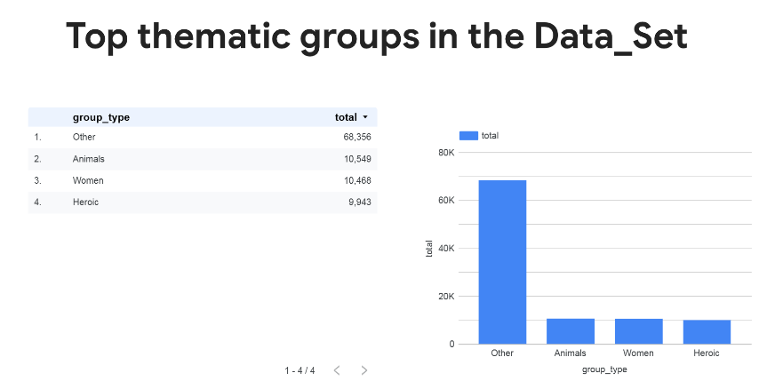
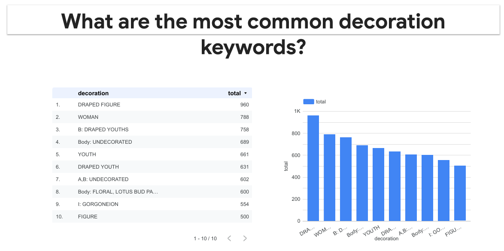
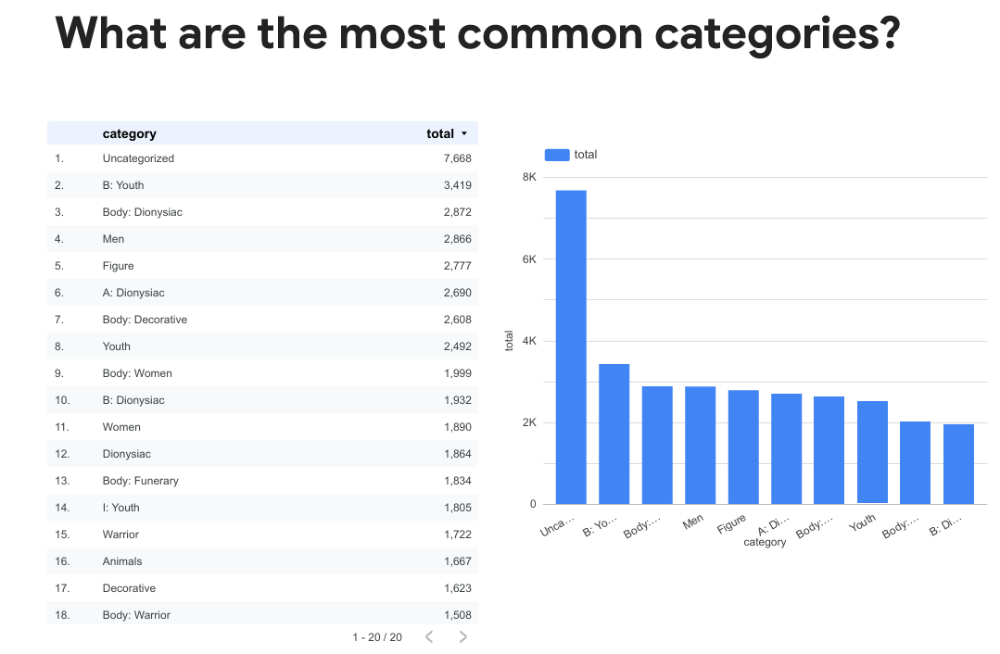

# 🚀 Automated Category Assignment for Ancient Pottery Data (GCP-Based ETL Pipeline)

## 📌 Overview
This project implements a **cloud-enabled ETL pipeline** to automatically populate the **Categories** column in a large Excel dataset (~100,000 records) by analyzing descriptive text in the **Decoration** column.

The solution replaces a **manual and time-consuming classification process** with an **automated, scalable pipeline** built using Python and Google Cloud Platform (GCP). It uses rule-based keyword matching to ensure consistent and accurate category assignment.

---

## 🏗️ Architecture (GCP-Based Pipeline)

**Flow:**

Excel File → Cloud Storage → Python ETL → BigQuery → Looker Studio

---

## 📂 Data Structure

### Input (Excel File)
- **Decoration**: Free-text descriptions (figures, scenes, activities)
- **Categories**: Initially empty, populated by the pipeline

### Notes
- Each row is processed as a single combined description  
- Object area designations (A, B, C, etc.) are not used  

---

## ⚙️ Processing Logic (ETL)

### 🔹 Extract
- Excel files are uploaded to **Cloud Storage**
- Python script fetches data from the cloud bucket

### 🔹 Transform
- Text cleaning and normalization using pandas  
- Keyword-based category mapping using dictionary rules  
- Regular expression matching for flexible patterns  
- Combination logic for multi-keyword conditions  
- Exclusion rules to prevent incorrect classification  

### 🔹 Load
- Processed data is:
  - saved back to **Cloud Storage** as updated Excel  
  - loaded into **BigQuery** for querying and analytics  

---

## 🔑 Key Features

- Automated category assignment using rule-based logic  
- Handles large datasets (~100K+ rows) efficiently  
- Data cleaning and normalization pipeline  
- Keyword mapping using Python dictionaries  
- Supports:
  - combined keyword rules  
  - exclusion logic  
- Cloud-based storage and processing  
- Integrated reporting using Looker Studio  

---

## 🧰 Tech Stack

- **Programming**: Python  
- **Libraries**: Pandas, Regular Expressions  
- **Cloud Platform**:  
  - Cloud Storage (data storage)  
  - BigQuery (analytics & querying)  
  - Looker Studio (reporting & dashboards)  
- **Database / Querying**: SQL (including stored procedures)  
- **Data Format**: Excel (.xlsx)

---

## 📊 Output

- Updated Excel file with **accurately populated Categories column** stored in Cloud Storage  
- Structured dataset in BigQuery for analysis  
- Interactive reports and dashboards in Looker Studio  

## 📊 Reports

[]

[]

[]

---
## 🚀 Business Impact

- Reduced manual effort by **~90–95%**  
- Improved data consistency and accuracy  
- Enabled scalable processing for large datasets  
- Faster report generation and decision-making  
- Future-ready architecture for growing data volumes  

---

## 🔮 Future Enhancements

- Deploy ETL pipeline using Cloud Run  
- Enable event-driven processing (trigger on file upload)  
- Fully automate pipeline execution  
- Enhance performance for larger datasets  

---

## ✅ Status
✔️ ETL pipeline designed and implemented  
✔️ Logic validated based on requirements  
✔️ Successfully handling large-scale dataset processing  
